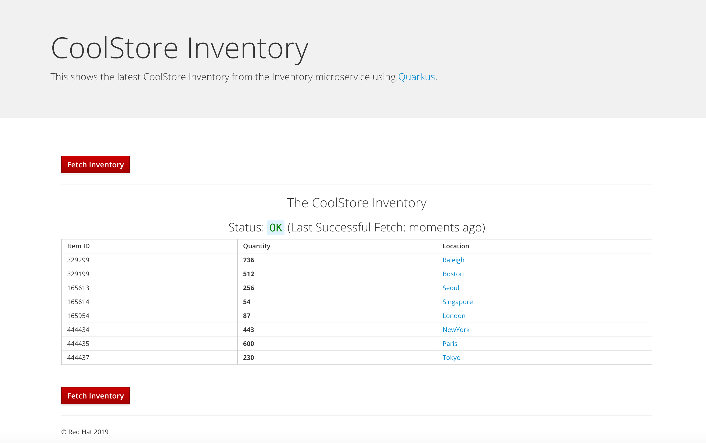
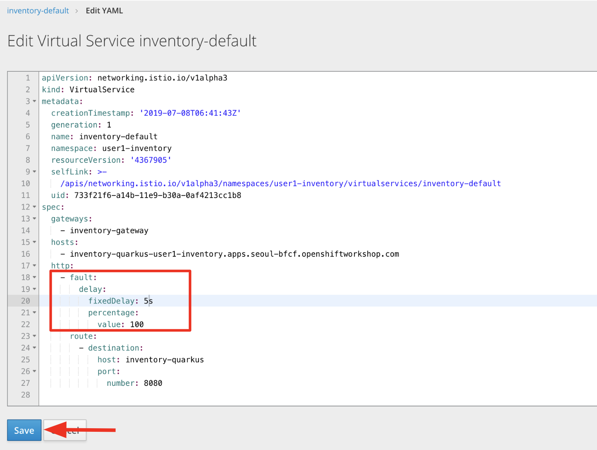
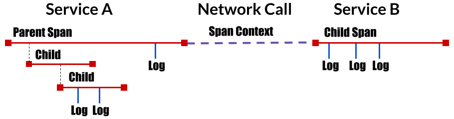

## Lab3 - Advanced Service Mesh Development

In this lab, you will develop advanced servie mesh features such as **Fault Injection**, **Traffic Shifting**, **Circuit Breaker**,
**Rate Limit** with **Coolstore microservices**(i.e Catalog, Inventory) that you developed and deployed to OpenShift cluster 
in **Module 1** or **Module 2**.

####1. Configuring Automatic Sidecar Injection in Coolstore Microservices

Lets' go to **Kiali console** once again to confirm if existing microservices(**Catalog**, **Inventory**) are running with a **side car**.
Click on **Applictions** on the left menu check **userXX-catalog**, **userXX-inventory** in namespaces. You will see `Missing Sidecar` in 4 applications. 

Upstream Istio community installations rely on the existence of a **proxy sidecar** within the application’s pod to provide service mesh capabilities to the application. You can include the proxy sidecar by using a manual process before deployment. However, automatic injection ensures that your application contains the appropriate configuration for your service mesh at the time of its deployment.

**Automatic injection of the sidecar** is supported by using the `sidecar.istio.io/inject` annotation within your application yaml file. Set the annotation’s value to true for injection to occur.

> Upstream Istio community installations require a specific label on the namespace after which all pods in that namespace are injected with the sidecar.  The OpenShift Service Mesh approach requires you to opt in to injection using an annotation with no need to label namspaces. This method requires fewer privileges and does not conflict with other OpenShift capabilities such as builder pods.

Go to **USERXX Coolstore Inventory Microservice Application** project in OpenShift Web Console and navigate **Applications > Deployments** on the left menu. Click on **inventory-database** then click on **Edit YAML** in Actions at the top-right corner.

Add the following annotation in **spec.template.metadata.annotations** path and click on **Save**:

`sidecar.istio.io/inject: "true"`

You will see **istio-init** container and **inventory-database** container in Pod Details page when you navigate **Applications > Pods** > **inventory-database-xxxxx**:

Now you will inject a sidecar container to application container(Inventory) as well, navigate **Applications > Deployments** on the left menu. Click on **inventory-quarkus** then click on **Edit YAML** in Actions at the top-right corner.

`sidecar.istio.io/inject: "true"`

You will see **istio-init** container and **inventory-quarkus** container in Pod Details page when you navigate **Applications > Pods** > **inventory-database-xxxxx**:

Next, go to **USERXX Coolstore Catalog Microservice Application** project in OpenShift Web Console and Navigate **Applications > Deployments** on the left menu. Click on **catalog-database** then click on **Edit YAML** in Actions at the top-right corner.

Add the following annotation in **spec.template.metadata.annotations** path and click on **Save**:

`sidecar.istio.io/inject: "true"`

You will see **istio-init** container and **catalog-database** container in Pod Details page when you navigate **Applications > Pods** > **catalog-database-xxxxx**:

Now you will inject a sidecar container to application container(Catalog) as well, Open **catalog-deployment.yml** in **src/main/fabric8** and 
copy the following annotation in **spec.template** path:

~~~yaml
metadata:
      annotations:
        sidecar.istio.io/inject: "true"
~~~

Re-build and re-deploy the project using the following command, which will use the maven plugin to deploy via CodeReady Workspace **Terminal**:

`cd cloud-native-workshop-v2m3-labs/catalog/`

`oc project userXX-catalog`

`mvn package fabric8:deploy -Popenshift -DskipTests`

The build and deploy may take a minute or two. Wait for it to complete. You should see a **BUILD SUCCESS** at the
end of the build output.

After the maven build finishes it will take less than a minute for the application to become available.
To verify that everything is started, run the following command and wait for it complete successfully:

You will see **istio-init** container and **spring-boot** container in Pod Details page when you navigate **Applications > Pods** > **catalog-xxxxx**:

Let's make sure if inventory and catalog services are working correctly via accessing **Catalog Route URL**:

`i.e. http://catalog-userXX-catalog.apps.seoul-bfcf.openshiftworkshop.com`

You will see the following web page including **Inventory Quantity** if the catalog service can access the inventory service via **Istio proxy sidecar**:

> Do not close the above **Catalog UI browser** to create traffics between services because this page continues to invoke catalog service and inventory service.

Now, reload **Applications** in **Kiali console** to check if the `Missing sidecar` doesn't show any longer:

Also, go to the Service Graph page and uncheck **userXX-inventory** in Namespace, check **Traffic Animation** in **Display** for understanding 
the traffic flow from catalog service to inventory service:

####2. Fault Injection

---

This step will walk you through how to use **fault injection** to test the end-to-end failure recovery capability of the application as a whole. An incorrect configuration of the failure recovery policies could result in unavailability of critical services. Examples of incorrect configurations include incompatible or restrictive timeouts across service calls.

**Istio** provides a set of failure recovery features that can be taken advantage of by the services
in an application. Features include:

* Timeouts
* Bounded retries with timeout budgets and variable jitter between retries
* Limits on number of concurrent connections and requests to upstream services
* Active (periodic) health checks on each member of the load balancing pool
* Fine-grained circuit breakers (passive health checks) – applied per instance in the load balancing pool

These features can be dynamically configured at runtime through Istio’s traffic management rules.

A combination of active and passive health checks minimizes the chances of accessing an unhealthy service.
When combined with platform-level health checks (such as readiness/liveness probes in OpenShift), applications
can ensure that unhealthy pods/containers/VMs can be quickly weeded out of the service mesh, minimizing the
request failures and impact on latency.

Together, these features enable the service mesh to tolerate failing nodes and prevent localized failures
from cascading instability to other nodes.

While Istio provides a host of failure recovery mechanisms outlined above, it is still imperative to test the
end-to-end failure recovery capability of the application as a whole. Misconfigured failure
recovery policies (e.g., incompatible/restrictive timeouts across service calls) could result
in continued unavailability of critical services in the application, resulting in poor user experience.

Istio enables protocol-specific fault injection into the network (instead of killing pods) by
delaying or corrupting packets at TCP layer.

Two types of faults can be injected: 

 * **Delays** are timing failures. They mimic increased network latency or an overloaded upstream service.
 * **Aborts** are crash failures. They mimic failures in upstream services. Aborts usually manifest in the form of HTTP error codes or TCP connection failures.

##### Inject a fault

To test our application microservices for resiliency, we will inject a failure(**500 status**) in `50%` of requests to `inventory` microservices.

Remove the route that we exposed the inventory service to manage network traffic by **Istio Ingressgateway**. Use the following command for **your own route name** at CodeReady Workspace **Terminal**:

> Copy the route URL(i.e. inventory-quarkus-user1-inventory.apps.seoul-bfcf.openshiftworkshop.com) and you will reuse the URL to create a gateway in Istio.

`oc delete route/inventory-quarkus -n userXX-inventory`

Add the following label in the Inventory service to use a **virtural service** via OpenShift Web Consle when you navigate **Applications > Services** > **inventory-quarkus**:

`service: inventory-quarkus`

Click on **Save**.

Create a **inventory-default.yaml** file in **cloud-native-workshop-v2m3-labs/inventory/rules/** to make a gateway and virtual service:

> You need to replace **<YOUR_IVENTORY_GATEWAY_URL>** with the previous route URL that you copied earlier.

~~~yaml
apiVersion: networking.istio.io/v1alpha3
kind: Gateway
metadata:
  name: inventory-gateway
spec:
  selector:
    istio: ingressgateway # use istio default controller
  servers:
  - port:
      number: 80
      name: http
      protocol: HTTP
    hosts:
    - '<YOUR_IVENTORY_GATEWAY_URL>'
---
apiVersion: networking.istio.io/v1alpha3
kind: VirtualService
metadata:
  name: inventory-default
spec:
  hosts:
  - '<YOUR_IVENTORY_GATEWAY_URL>'
  gateways:
  - inventory-gateway
  http:
    - match:
        - uri:
            exact: /services/inventory
        - uri:
            exact: /
      route:
        - destination:
            host: inventory-quarkus
            port:
              number: 8080
~~~

Run the following command via CodeReady Workspace **Terminal**:

`oc create -f cloud-native-workshop-v2m3-labs/inventory/rules/inventory-default.yaml -n userXX-inventory`

Now, you can test if the inventory service works correctly via accessing the gateway URL:

`i.e. http://inventory-quarkus-user1-inventory.apps.seoul-bfcf.openshiftworkshop.com`

Let's inject a failure(**500 status**) in `50%` of requests to `inventory` microservices. Go to **Virtual Service** in **Other Resources** in OpenShift Web Console and Click on **Edit YAML** in inventory-default:

Edit **http** element with **fault.abort** injection as below and click on **Save**:

~~~yaml
- fault:
    abort:
      httpStatus: 500
      percentage:
        value: 50
~~~

Let's find out if the fault injection works corectly via accessing the Inventory gateway once again. You will see that the **Status** of CoolStore Inventory continues to change between **DEAD** and **OK**:

To make sure if the **50%** traffic is failed with **500 Error** in **Kiali Graph**. You will see `red` traffic from **istio-ingressgateway** as well as around 50% of requests are displayed as `5xx` on the right side, **HTTP Traffic**. The reason why the error rate is not exact 50% is that the request keeps coming from catalog and ingress gateway at the same time.

Let's make another injection in terms of you will introduce a `5 second delay` in `100% of requests` to Inventory service. Go to **Virtual Service** in **Other Resources** in OpenShift Web Console and Click on **Edit YAML** in inventory-default:

Edit **http** element with **fault.delay** injection as below and click on **Save**:

~~~yaml
- fault:
    delay:
      fixedDelay: 5s
      percentage:
        value: 100
~~~

When we go to **Kiali Graph**, you will see that the **green** traffic from **istio-ingressgateway** is delayed than requests from catalog service. Note that you need to check **Traffic Animation** in Display select box.

If the Inventory’s front page was set to correctly handle delays, we expect it to load within
approximately 5 seconds. To see the web page response times, open the Developer Tools menu in
IE, Chrome or Firefox (typically, key combination `Ctrl`+`Shift`+`I` or `Alt`+`Cmd`+`I`), tab Network,
and reload the bookinfo web page.

You will see and feel that the webpage loads in about 5 seconds:

Before we will move to the next step, clean up the fault injection with the default virtual service as here:

~~~yaml
http:
  - match:
      - uri:
          exact: /services/inventory
      - uri:
          exact: /
    route:
      - destination:
          host: inventory-quarkus
          port:
            number: 8080
~~~

####3. Enable Circuit Breaker

---

In this step, you will configure an Istio Circuit Breaker to protect the calls `Inventory` service.
If the `Inventory` service gets overloaded due to call volume, Istio (in conjunction with Kubernetes) will limit
future calls to the service instances to allow them to recover.

Circuit breaking is a critical component of distributed systems.
It’s nearly always better to fail quickly and apply back pressure downstream
as soon as possible. Istio enforces circuit breaking limits at the network
level as opposed to having to configure and code each application independently.

Istio supports various types of circuit breaking:

* **Cluster maximum connections**: The maximum number of connections that Istio will establish to all hosts in a cluster.
* **Cluster maximum pending requests**: The maximum number of requests that will be queued while waiting for a
ready connection pool connection.
* **Cluster maximum requests**: The maximum number of requests that can be outstanding to all hosts in a
cluster at any given time. In practice this is applicable to HTTP/2 clusters since HTTP/1.1 clusters are
governed by the maximum connections circuit breaker.
* **Cluster maximum active retries**: The maximum number of retries that can be outstanding to all hosts
in a cluster at any given time. In general Istio recommends aggressively circuit breaking retries so that
retries for sporadic failures are allowed but the overall retry volume cannot explode and cause large
scale cascading failure.

> Note that HTTP 2 uses a single connection and never queues (always multiplexes), so max connections and
max pending requests are not applicable.

Each circuit breaking limit is configurable and tracked on a per upstream cluster and per priority basis.
This allows different components of the distributed system to be tuned independently and have different limits.
See the [Envoy’s circuit breaker](https://www.envoyproxy.io/docs/envoy/latest/intro/arch_overview/upstream/circuit_breaking) for more details.

Let's add a circuit breaker to the calls to the `Inventory` service. Instead of using a _VirtualService_ object,
circuit breakers in isto are defined as _DestinationRule_ objects. DestinationRule defines policies that apply to traffic intended for a service after routing has occurred. These rules specify configuration for load balancing, connection pool size from the sidecar, and outlier detection settings to detect and evict unhealthy hosts from the load balancing pool.

Create a **inventory-cb.yaml** file in **cloud-native-workshop-v2m3-labs/inventory/rules/** to apply 
circuit breaking settings when calling the `Inventory` service:

~~~yaml
apiVersion: networking.istio.io/v1alpha3
kind: DestinationRule
metadata:
  name: inventory-cb
spec:
  host: inventory-quarkus
  trafficPolicy:
    connectionPool:
      tcp:
        maxConnections: 1
      http:
        http1MaxPendingRequests: 1
        maxRequestsPerConnection: 1
~~~

> If you installed/configured Istio with mutual TLS authentication enabled, you must add a TLS traffic policy mode: ISTIO_MUTUAL to the DestinationRule before applying it. 

Run the following command via CodeReady Workspace **Terminal**:

`oc create -f cloud-native-workshop-v2m3-labs/inventory/rules/inventory-cb.yaml -n userXX-inventory`

We set the `Inventory` service's maximum connections to 1 and maximum pending requests to 1. Thus, if we send more
than 2 requests within a short period of time to the reviews service, 1 will go through, 1 will be pending,
and any additional requests will be denied until the pending request is processed. Furthermore, it will detect any hosts that
return a server error (5XX) and eject the pod out of the load balancing pool for 15 minutes. You can visit
here to check the
[Istio spec](https://istio.io/docs/reference/config/traffic-rules/destination-policies.html#istio.proxy.v1.config.CircuitBreaker.SimpleCircuitBreakerPolicy)
for more details on what each configuration parameter does.

####4. Overload the service

---

Let's use some simple `curl` commands to send multiple concurrent requests to our application, and witness the
circuit breaker kicking in opening the circuit.

Execute this to simulate a number of users attampting to access the gateway URL simultaneously:

Your Inventory gateway URL seems like **http://inventory-quarkus-user1-inventory.apps.seoul-6eb1.openshiftworkshop.com**

~~~shell
    for i in {1..50} ; do
        curl 'http://YOUR_IVENTORY_GATEWAY_URL/services/inventory' >& /dev/null &
    done
~~~

Due to the very conservative circuit breaker, many of these calls will fail with HTTP 503 (Server Unavailable). To see this,
open the `Istio Service Mesh Dashboard` in Grafana console and select `inventory-quarkus.userxx-inventory.svc.cluster.local` service:

> **NOTE**: It make take 10-20 seconds before the evidence of the circuit breaker is visible
within the Grafana dashboard, due to the not-quite-realtime nature of Prometheus metrics and Grafana
refresh periods and general network latency.

That's the circuit breaker in action, limiting the number of requests to the service. In practice your limits would be much higher.

####5. Stop overloading

---

Before moving on, stop the traffic generator by executing the following commands in CodeReady Workspace **Terminal**:

`for i in {1..50} ; do kill %${i} ; done`

Delete the circuit breaker of the Inventory service via the following commands. You should replace **userxx** with your namespace:

`oc delete destinationrule/inventory-cb -n userxx-inventory`

####6. Rate Limiting

---

In this step, we will use Istio's Quota Management feature to apply
a rate limit on the `ratings` service.

* Quotas in Istio
Quota Management enables services to allocate and free quota on a
based on rules called _dimensions_. Quotas are used as a relatively
simple resource management tool to provide some fairness between
service consumers when contending for limited resources.
Rate limits are examples of quotas, and are handled by the
[Istio Mixer](https://istio.io/docs/concepts/policy-and-control/mixer.html).

* Generate some traffic

As before, let's start up some processes to generate load on the app. Execute this command:

~~~shell
while true; do
    curl -o /dev/null -s -w "%{http_code}\n" \
      http://istio-ingress-istio-system.[[HOST_SUBDOMAIN]]-80-[[KATACODA_HOST]].environments.katacoda.com/productpage
  sleep .2
done
~~~

This command will endlessly access the application and report the HTTP status result in a separate terminal window.

With this application load running, we can witness rate limits in action.

####7. Add a rate limit

---

Execute the following command:

`oc create -f samples/bookinfo/kube/mixer-rule-ratings-ratelimit.yaml`

This configuration specifies a default 1 qps (query per second) rate limit. Traffic reaching
the `ratings` service is subject to a 1qps rate limit. Verify this with Grafana:

* Grafana Dashboard at 

`http://grafana-istio-system.$ROUTE_SUFFIX/dashboard/db/istio-dashboard`

Scroll down to the `ratings` service and observe that you are seeing that some of the requests sent
from `reviews:v3` service to the `ratings` service are returning HTTP Code 429 (Too Many Requests).

In addition, at the top of the dashboard, the '4xxs' report shows an increase in 4xx HTTP codes. We are being
rate-limited to 1 query per second:

####8. Inspect the rule

---

Take a look at the new rule:

`oc get memquota handler -o yaml`

In particular, notice the _dimension_ that causes the rate limit to be applied:

~~~yaml
# The following override applies to 'ratings' when
# the source is 'reviews'.
- dimensions:
    destination: ratings
    source: reviews
  maxAmount: 1
  validDuration: 1s
~~~

You can also conditionally rate limit based on other dimensions, such as:

* Source and Destination project names (e.g. to limit developer projects from overloading the production services during testing)
* Login names (e.g. to limit certain customers or classes of customers)
* Source/Destination hostnames, IP addresses, DNS domains, HTTP Request header values, protocols
* API paths
* [Several other attributes](https://istio.io/docs/reference/config/mixer/attribute-vocabulary.html)

####9. Remove the rate limit

---

Before moving on, execute the following to remove our rate limit:

`oc delete -f samples/bookinfo/kube/mixer-rule-ratings-ratelimit.yaml`

Verify that the rate limit is no longer in effect. Open the dashboard:

* Grafana Dashboard at 

`http://grafana-istio-system.$ROUTE_SUFFIX/dashboard/db/istio-dashboard`

Notice at the top that the `4xx`s dropped back down to zero.

**Congratulations!** In the final step, we'll explore distributed tracing and how it can help diagnose and fix issues in
complex microservices architectures. Let's go!

####10. Tracing

---

This step shows you how Istio-enabled applications automatically collect
_trace spans_ telemetry and can visualize it with tools like using Jaeger or Zipkin.
After completing this task, you should
understand all of the assumptions about your application and how to have it
participate in tracing, regardless of what language/framework/platform you
use to build your application.

##### Tracing Goals

Developers and engineering organizations are trading in old, monolithic systems
for modern microservice architectures, and they do so for numerous compelling
reasons: system components scale independently, dev teams stay small and agile,
deployments are continuous and decoupled, and so on.

Once a production system contends with real concurrency or splits into many
services, crucial (and formerly easy) tasks become difficult: user-facing
latency optimization, root-cause analysis of backend errors, communication
about distinct pieces of a now-distributed system, etc.

##### What is a trace?

At the highest level, a trace tells the story of a transaction or workflow as
it propagates through a (potentially distributed) system. A trace is a directed
acyclic graph (DAG) of _spans_: named, timed operations representing a
contiguous segment of work in that trace.

Each component (microservice) in a distributed trace will contribute its
own span or spans. For example:

This type of visualization adds the context of time, the hierarchy of
the services involved, and the serial or parallel nature of the process/task
execution. This view helps to highlight the system's critical path. By focusing
on the critical path, attention can focus on the area of code where the most
valuable improvements can be made. For example, you might want to trace the
resource allocation spans inside an API request down to the underlying blocking calls.

####11. Access Jaeger Console

---

With our application up and our script running to generate loads, visit the Jaeger Console:

* Jaeger Query Dashboard at 

`http://jaeger-query-istio-system.$ROUTE_SUFFIX`

Select `istio-ingress` from the _Service_ dropdown menu, change the value of **Limit Results** to `200` and click **Find Traces**:

In the top right corner, a duration vs. time scatter plot gives a visual representation of the results, showing how and when
each service was accessed, with drill-down capability. The bottom right includes a list of all spans that were traced over the last
hour (limited to 200).

If you click on the first trace in the listing, you should see the details corresponding
to a recent access to `/productpage`. The page should look something like this:

As you can see, the trace is comprised of _spans_, where each span corresponds to a
microservice invoked during the execution of a `/productpage` request.

The first line represents the external call to the entry point of our application controlled by
 `istio-ingress`. It in thrn calls the `productpage` service. Each line below
represents the internal calls to the other services to construct the result, including the
time it took for each service to respond.

To demonstrate the value of tracing, let's re-visit our earlier timeout bug! If you recall, we had
injected a 7 second delay in the `ratings` microservice for our user _jason_. So when we loaded the
web page it should have taken 7 seconds before showing the star ratings.

In reality, the webpage loaded in 6 seconds and we saw no rating stars! Why did this happen? We know
from earlier that it was because the timeout from `reviews`->`ratings` was much shorter than the `ratings`
timeout itself, so it prematurely failed the access to `ratings` after 2 retries (of 3 seconds each), resulting
in a failed webpage after 6 seconds. But can we see this in the tracing? Yes, we can!

To see this bug, open the Jaeger tracing console:

* Jaeger Query Dashboard at 

`http://jaeger-query-istio-system.$ROUTE_SUFFIX`

Since users of our application were reporting lengthy waits of 5 seconds or more, let's look for traces
that took at least 5 seconds. Select these options for the query:

* **Service**: `istio-ingress`
* **Min Duration**: `5s`

Then click **Find Traces**. Change the sorting to **Longest First** to see the ones that took the longest.
The result list should show several spans with errors:

Click on the top-most span that took ~10s and open details for it:

Here you can see the `reviews` service takes 2 attempts to access the `ratings` service, with each attempt
timing out after 3 seconds. After the second attempt, it gives up and returns a failure back to the product
page. Meanwhile, each of the attempts to get ratings finally succeeds after its fault-injected 7 second delay,
but it's too late as the reviews service has already given up by that point.

The timeouts are incompatible, and need to be adjusted. This is left as an exercise to the reader.

Istio’s fault injection rules and tracing capabilities help you identify such anomalies without impacting end users.

> **NOTE**: Let's stop the load generator running against our app. Navigate to **Terminal 2** and type
`CTRL-C` to stop the generator or click `clear`.

**Congratulations!** Distributed tracing speeds up troubleshooting by allowing developers to quickly understand
how different services contribute to the overall end-user perceived latency. In addition,
it can be a valuable tool to diagnose and troubleshoot distributed applications.

####12. Enable RH-SSO

---

#### Summary

In this scenario you used Istio to implement many of the
Istio provides an easy way to create a network of deployed services with load balancing, service-to-service authentication, monitoring, and more, without requiring any changes in service code. You add Istio support to services by deploying a special sidecar proxy throughout your environment that intercepts all network communication between microservices, configured and managed using Istio’s control plane functionality.

Technologies like containers and container orchestration platforms like OpenShift solve the deployment of our distributed
applications quite well, but are still catching up to addressing the service communication necessary to fully take advantage
of distributed microservice applications. With Istio you can solve many of these issues outside of your business logic,
freeing you as a developer from concerns that belong in the infrastructure. Congratulations!

Additional Resources:

* [Istio on OpenShift via Veer Muchandi](https://github.com/VeerMuchandi/istio-on-openshift)
* [Envoy resilience examples](http://blog.christianposta.com/microservices/00-microservices-patterns-with-envoy-proxy-series/)
* [Istio and Kubernetes workshop from KubeCon 2017 via Zach Butcher, et. al.]()
* [Istio and Kubernetes workshop](https://github.com/retroryan/istio-workshop)
* [Bookinfo from http://istio.io](https://istio.io/docs/tasks/traffic-management/request-routing.html)
